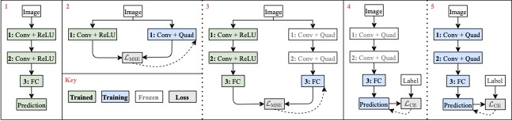

## **Qua**dratic **I**mitation **L**earning (QuaIL).
This directory contains code for QuaIL: a training pipeline that gradually builds neural networks using polynomial activation functions.

### Files:
1. `quail*.py`: Trains neural networks with the  activation function using the QuaIL training pipeline.
